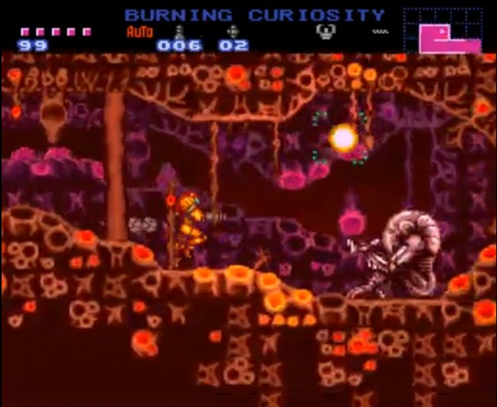
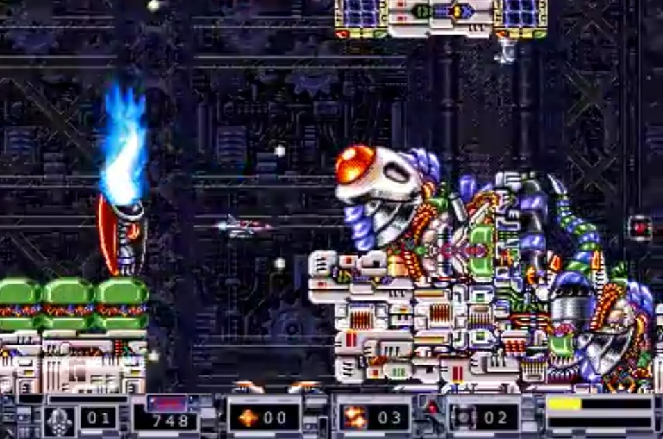
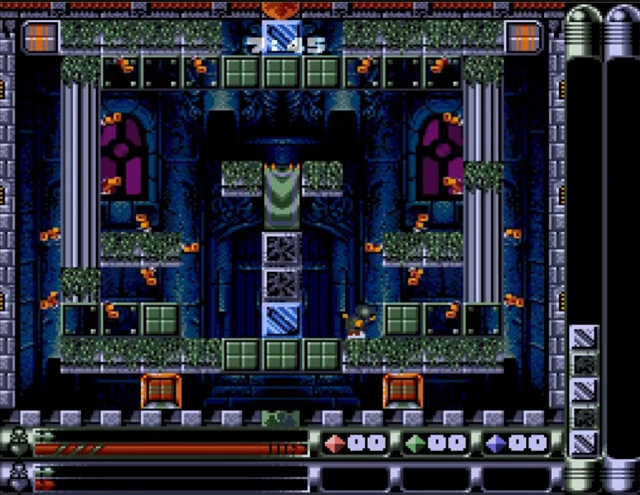
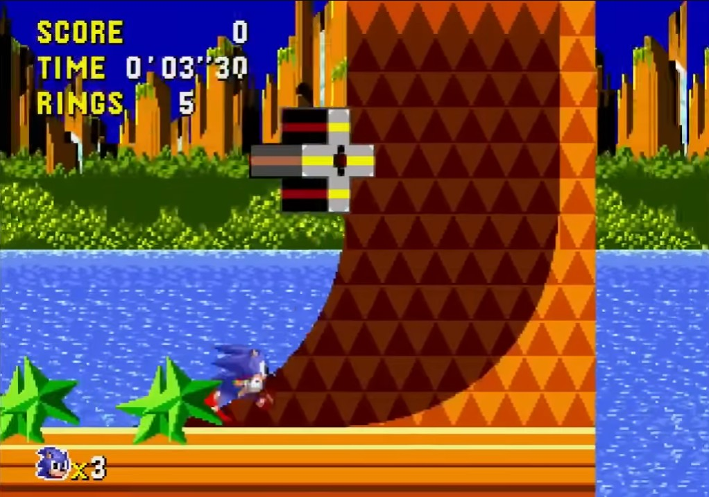
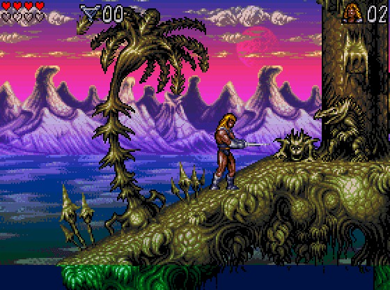
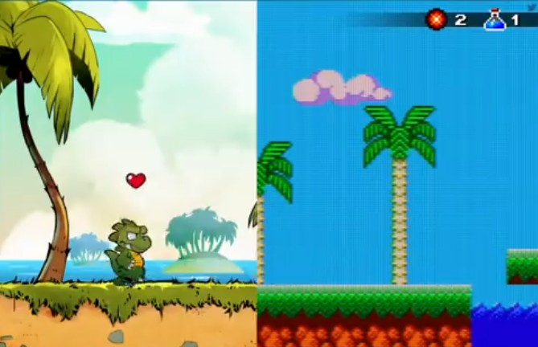

# RetroChroniques
Mes chroniques de jeux vidéo rétro Amiga, GBA, Megadrive, Mega CD, SNES, PC, PS1, ROM Hacks et Fan Games...

[https://modrigue.github.io/RetroChroniques](https://modrigue.github.io/RetroChroniques)

 

 

 

Pour générer le flux RSS :

```bash
node js/generate-rss.js
```
